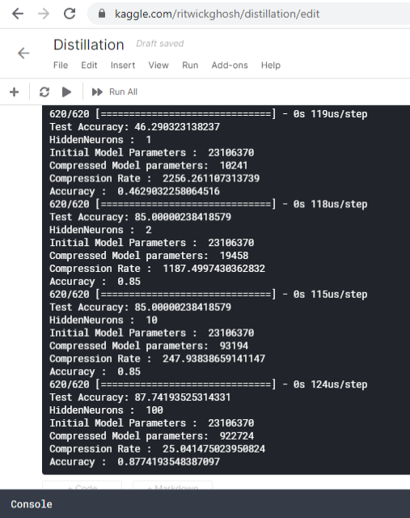

# Compressed_CNN_Radiology_Image
### Dataset:
[Chest X-Ray Images (Pneumonia)](https://www.kaggle.com/paultimothymooney/chest-xray-pneumonia)
- The dataset is organized into 3 folders (train, test, val) and contains subfolders for each image category (Pneumonia/Normal). There are 5,863 X-Ray images (JPEG) and 2 categories (Pneumonia/Normal).
Chest X-ray images (anterior-posterior) were selected from retrospective cohorts of pediatric patients of one to five years old from Guangzhou Women and Children’s Medical Center, Guangzhou. All chest X-ray imaging was performed as part of patients’ routine clinical care.

- For the analysis of chest x-ray images, all chest radiographs were initially screened for quality control by removing all low quality or unreadable scans. The diagnoses for the images were then graded by two expert physicians before being cleared for training the AI system. In order to account for any grading errors, the evaluation set was also checked by a third expert.

Acknowledgements
Data: https://data.mendeley.com/datasets/rscbjbr9sj/2

License: CC BY 4.0

Citation: http://www.cell.com/cell/fulltext/S0092-8674(18)30154-5

### Requirements: Tested on Kaggle notebooks for now.

### Primary Tests:
- Transfer learning using Imagenet weights fetch better result than the same type of architecture when trained from scatch.
- Tested Architectures (Keras): VGG16, VGG19, ResNet, InceptionV3, InceptionResNet, DenseNet, NASNetLarge.
- Primary target was to determine the cnn architecture with minimum parameters with best accuracy.

| Model_Inspired | Transfer Learning | Parameter(M) | Best Accuracy(%) |
| --- | --- | --- | --- |
| VGG16 |Yes | 23 | 92.79 |
| VGG19 | Yes | 28.4 | 89.27 |

## Compressing The CNN:

### 1. Depthwise Seperable Convolution Network:
#### Paper:
[MobileNets: Efficient Convolutional Neural Networks for Mobile Vision Applications](https://arxiv.org/abs/1704.04861)
#### Result: 
- Used Keras Architecture: MobileNet, MobileNetV2, NASNetMobile. Best Accuracy:

| Model_Inspired | Transfer Learning | Parameter(M) | Best Accuracy(%) |
| --- | --- | --- | --- |
| MobileNet(V1)  | Yes               | 20           | 77.4             |
#### Discussion: 
- Using depthwise convolution layers decrease the parameters count. But to obtain high accuracy, transfer learning enbled models have high count of parameters.

### 2. Deep Compression:
#### Paper:
[Deep Compression: Compressing Deep Neural Networks with Pruning, Trained Quantization and Huffman Coding](https://arxiv.org/abs/1510.00149)
#### Result:

| Model_Inspired | Transfer Learning | Pruning Rate | Best Accuracy(%) | Parameters(M) |
| --- | --- | --- | --- | --- |
| VGG16 | Yes | 0.9 - 0.1 | 62.5 | 23 |
| VGG16 | No | 0.9 - 0.1 | 64.1 | 14 |
#### Discussion:
- It uses pruning, trained quatization and huffman coding to compress cnn model. The rate is 5x to 30x approximately. But the low accuracy was not desired, but regarding it's compression rate, large cnn may be used, which will have better accuracy.

### 3. Distillation:
#### Paper:
[Distilling the Knowledge in a Neural Network](https://arxiv.org/abs/1503.02531)
#### Result: 
The main cnn was VGG16 with accuracy 84%. The distilled model shows the accuracy of 70-78%.
### Hinton Regression (Distillisation)

#### Discussion:
- Distillation uses larger network to teach a smaller network.

### 4. SVD and Tucker:
#### Paper:
[Randomized Algorithms for Computation of Tucker decomposition and Higher Order SVD (HOSVD)](https://arxiv.org/abs/2001.07124)
#### Result: 
- Not Tested Yet but CODING almost complete.
#### Discussion:
- Matrix compression using singulat value decomposition (SVD) and tensor compression using Tucker decomposition.

### 5. Bitwise Binary Convolution: (XNORNet)
#### Paper:
[XNOR-Net: ImageNet Classification Using Binary Convolutional Neural Networks](https://arxiv.org/abs/1603.05279)
#### Result:
- Not Tested Yet but CODING almost complete.
#### Discussion:
- Efficient approximation of standard cnnusing bitwise binary weight networks. It would be easy to test upon VGG type of architecture.

### 6. MIRACLE (Minimal Random Code Learning):
#### Paper:
[Minimal Random Code Learning: Getting Bits Back from Compressed Model Parameters](https://arxiv.org/abs/1810.00440)
#### *Coming Up*
